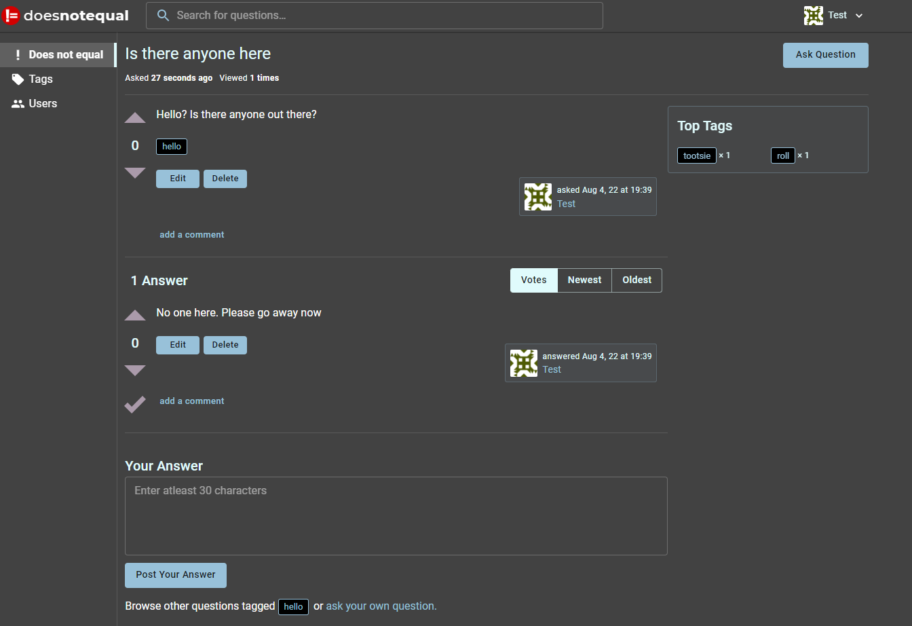

# does-not-equal

## Concept:
<blockquote>

THis project is designed to be a technology Q&A forum allowing comments, responses and voting. Technologies used include React, MongoDP, Express, Node, Material UI, Apollo Server and GraphQL.

Deployed Link: [ChatAppLive](https://does-not-equal.herokuapp.com/)

</blockquote>

## Table of Contents
- [Images](#images)
- [Contact](#questions)
- [license](#license)

## Images:
Screenshot:

Website:
Github Repo: https://github.com/Crimsondrac1/console-log
Heroku: https://does-not-equal.herokuapp.com

## Contributors:

Jose Miguel Fernandez, Doug Erickson